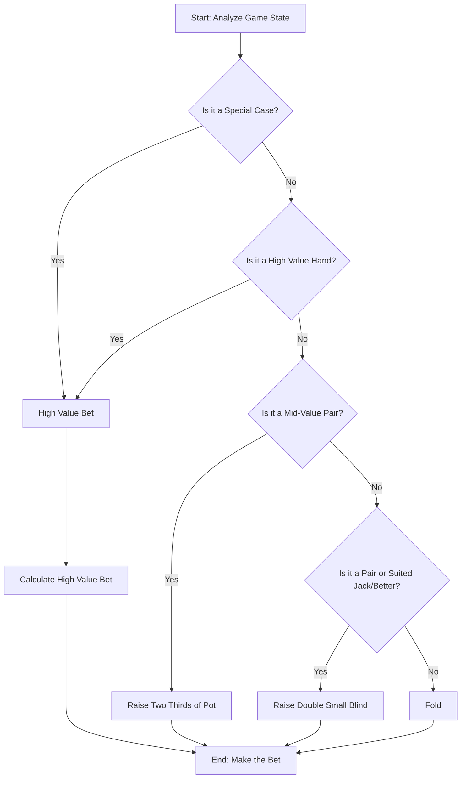

Created by [ChatGPT](https://chat.openai.com/share/22684e47-53c6-4945-a671-4289d30ad16e) 

```mermaid
flowchart TD
    A[Start: Analyze Game State] --> B{Is it a Special Case?}
    B -- Yes --> C[High Value Bet]
    B -- No --> D{Is it a High Value Hand?}
    D -- Yes --> C
    D -- No --> E{Is it a Mid-Value Pair?}
    E -- Yes --> F[Raise Two Thirds of Pot]
    E -- No --> G{Is it a Pair or Suited Jack/Better?}
    G -- Yes --> H[Raise Double Small Blind]
    G -- No --> I[Fold]
    C --> J[Calculate High Value Bet]
    J --> K[End: Make the Bet]
    F --> K
    H --> K
    I --> K
```
